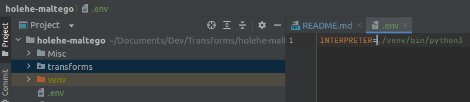
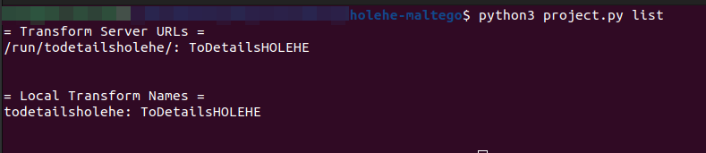
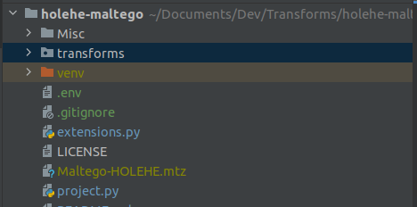
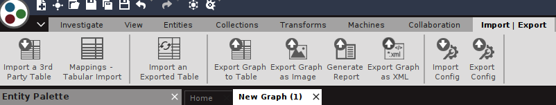

# [Holehe](https://github.com/megadose/holehe/) Maltego Transform
👋 Hi there! For any professional inquiries or collaborations, please reach out to me at:
megadose@protonmail.com

📧 Preferably, use your professional email for correspondence. Let's keep it short and sweet, and all in English!

#### For BTC Donations : 1FHDM49QfZX6pJmhjLE5tB2K6CaTLMZpXZ
holehe allows you to check if the mail is used on different sites like Twitter, instagram and will retrieve information 
on sites with the forgotten password function.
Educational purposes only

## Example

## Installation

Install the required libraries by running

`pip install -r requirements.txt`

A Maltego configuration file **Maltego-HOLEHE.mtz** can be automatically generated to easily import the Transforms and 
Transform Set into your client.

First you need to update your ENV file with the Path to your Python Interpreter.

1. Open the project's directory "holehe-maltego".
2. Locate the .env file (Enable show Hidden files if using your OS explorer) and add the path to your Python 
interpreter without spaces.

Now we are ready to generate the Maltego-HOLEHE.mtz configuration file

1. Open your Terminal and go to your project's main directory.
2. Run `python3 project.py list`

That's all you need, you should now have the new configuration file inside your project.

Simply import the file into your client by going to Import | Export > Import Config > Select mtz file.

Your new configuration file includes a Transform set called "HOLEHE" which will arrange your new Transforms into a 
submenu, making them easier to find and use.

If you are a more advanced user and want to manually add the Transforms to your client, you can check 
the [wiki](https://github.com/megadose/holehe-maltego/wiki/Installation)

## 📝 License
[GNU General Public License v3.0](https://www.gnu.org/licenses/gpl-3.0.fr.html)
